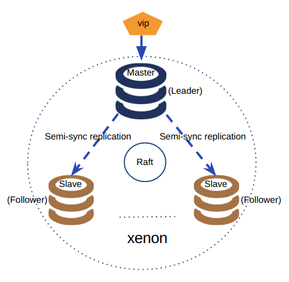

# Xenon

## Overview

`Xenon` is an HA MySQL and replication management tool adopting the Raft protocol.

`Xenon` has many cool features, such as:

🎂 Fast failover without loss of transactions

🎈 Streaming and speed-unmatched backup/restore

🎨 MySQL O&M

🎯 No central control and easy to deploy

☁ As a cloud App

## Architecture

## Documentation

- [Build and run xenon](docs/how_to_build_and_run_xenon.md)
- [Xenon CLI commands](docs/xenoncli_commands.md)
- [How Xenon works](docs/how_xenon_works.md)
- [how Xenon upgrades](docs/how_xenon_upgrades.md)

## Use cases

`Xenon` is production-ready, and it has been used in production:

🍉 [MySQL Plus](https://www.qingcloud.com/products/mysql-plus/) - a high-availability MySQL cluster

🍊 [RadonDB](https://www.qingcloud.com/products/radondb) - a cloud-native MySQL database for building global and scalable cloud services

## Issue

The [integrated github issue tracker](https://github.com/radondb/xenon/issues) is used for this project.

## License

Xenon is released under the GPLv3. See [LICENSE](LICENSE)